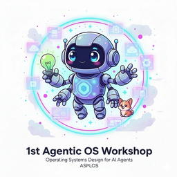
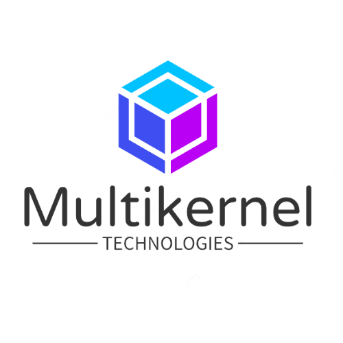

<!-- _paginate: false -->
<!-- _class: title -->

# Agentic OS

### The 1st Workshop on Operating Systems Design for AI Agents

  &#x1F4C5; March 23, 2026
  &#x1F4CD; Pittsburgh, PA
  &#x1F552; 1:30 – 6:00 PM EDT

https://os-for-agent.github.io/

---

## About This Workshop

> AI agents are evolving from prototypes to always-on services that autonomously plan, invoke tools, and interact with their environment. **Operating systems must become _agentic_.**

**Topics:** OS abstractions for agents · sandboxing & runtimes · scheduling & resource management · agent state & memory · eBPF observability · GPU virtualization · security & isolation · agents managing systems

---

## Program Committee and Organizers

**Program Committee (Chair: Dong Li, UC Merced)**

Dan Williams (Virginia Tech) · Yiying Zhang (UCSD) · Wei Zhang (UConn) · Michael Swift (UW-Madison) · Dmitrii Ustiugov (NTU Singapore) · Mingxing Zhang (Tsinghua) · Mengwei Xu (BUPT) · Mingyu Li (CAS) · Gan Fang (Roblox) · Mark Wu (Roblox)

**Organizers**

**Cong Wang**, Founder & CEO, Multikernel Technologies
**Dong Du**, Assistant Professor, Shanghai Jiao Tong University
**Huaizheng Zhang**, Staff Research Scientist, ByteDance
**Wenhui Zhang**, Senior Software Engineer, Roblox
**Yusheng Zheng**, PhD Student, UC Santa Cruz

---

## Submissions & Acceptance

  

    
25

    
Papers Received

  

  
→

  

    
12

    
Papers Accepted

  

Acceptance rate: 48%

- **7** research papers (up to 6 pages) &nbsp;&nbsp;·&nbsp;&nbsp; **5** vision papers (1–2 pages)
- Each submission received at least **two reviews**

---

## Talk Format & Q&A

- This workshop is being recorded
- **Research papers:** 15 min (12 min talk + 3 min Q&A)
- **Vision papers:** 10 min (8 min talk + 2 min Q&A)
- Please hold questions until the end of each talk
- Time signals: **2-min warning** before your time is up
- All accepted papers and presentation slides will be made available on the website

---

## Today's Schedule

| Time (EDT) | Session | Details |
|---|---|---|
| 1:30 – 1:35 | Opening | Opening Remarks |
| 1:35 – 2:00 | Keynote | Keynote by Prof. Dan Williams (25 min) |
| 2:00 – 3:30 | Papers | Session 1 - 7 papers (research + vision) |
| 3:30 – 4:00 | Break | Break (with snacks & beverages) (30 min) |
| 4:00 – 4:15 | Invited Talk | Guanlan Dai |
| 4:15 – 5:20 | Papers | Session 2 - 5 papers (research + vision) |
| 5:20 – 5:25 | Awards | Best Paper Awards + Closing |
| 5:25 – 6:00 | Social | Networking |
| 6:30 | Social | **Social Dinner** |

---

## Acknowledgments

- All authors for their submissions; we received many strong papers and wish our half-day format allowed us to accept more
- Our program committee for their thorough and timely reviews
- Workshop organizers for putting everything together
- The ASPLOS 2026 conference for hosting us
- Most importantly, all of you for joining the inaugural Agentic OS!

---

<!-- _class: next -->

## 2nd Agentic OS Workshop Is Coming!

### Co-located with **SOSP 2026**

📅 **September 29, 2026** &nbsp;&nbsp;|&nbsp;&nbsp; 📍 **Prague, Czechia**

🔗 https://sigops.org/s/conferences/sosp/2026/workshops.html

### We look forward to your submissions!

---

<!-- _paginate: false -->
<!-- _class: sponsor -->

Sponsored by

 

*Thank you for your support.*
